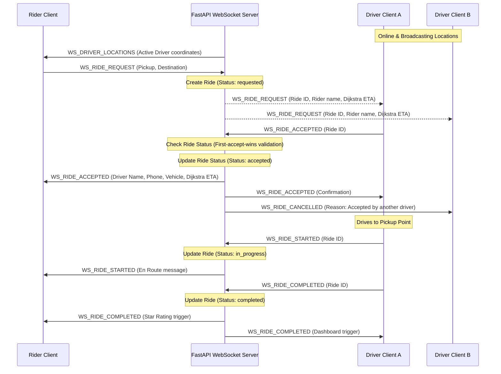

# ERide — IIT Roorkee E-Rickshaw Ride Hailing System
## Technical Design Document

---

> **Note for Evaluators**: To export this document as a PDF to satisfy the Deliverable 2 requirements, please use your browser's Print feature (`Ctrl+P` or `Cmd+P`) and select **Save as PDF**, or use a markdown-to-pdf converter.

## 1. Problem Understanding

IIT Roorkee spans a large geographical area (approx 365 acres) with hostels, departments, administrative blocks, and recreation hubs widely distributed. The primary last-mile transportation relies on campus e-rickshaws. Currently, coordination is informal and fragmented: riders stand by roads waiting, while drivers cruise with uneven demand, leading to long wait times, traffic congestion at main gates, and inefficient driver earnings.

### Objective
The **ERide** platform is a full-stack, real-time campus mobility application that connects passengers and e-rickshaw drivers. 
- **Riders** can check online driver locations, search campus destinations, view visual destination previews, request rides on-demand with optimized road routing, or schedule future classes/travel bookings.
- **Drivers** can toggle online availability, review incoming on-demand requests, claim scheduled bookings, navigate using optimized campus road routes, and monitor dashboard performance metrics, recent reviews, and machine learning demand hotspot forecasts.

---

## 2. System Architecture

ERide utilizes a decoupled client-server architecture with stateful real-time synchronization over WebSockets alongside stateless RESTful APIs.

```mermaid
graph TD
    subgraph Frontend [Client Web Application (HTML5 / Vanilla JS / CSS3 / PWA)]
        RiderUI[Rider Dashboard]
        DriverUI[Driver Dashboard / Tabbed Panel]
        MapModule[Leaflet & OSM Map Module]
        Routing[Dijkstra Route Planner]
        ChartModule[Chart.js Visualizer]
    end

    subgraph Backend [Server Application (FastAPI / Python)]
        RouterAuth[Auth Router & JWT Validator]
        RouterRides[REST Ride Router]
        WSManager[WebSocket Connection Manager]
        ETACalc[Haversine ETA Calculator]
        Forecaster[Hybrid Demand Forecaster]
    end

    subgraph Database [Storage Layer (SQLite / aiosqlite)]
        DB[(eride.db SQLite Database)]
    end

    RiderUI -->|REST Auth/Profile/History| RouterAuth
    DriverUI -->|REST Stats/Scheduled/Forecast| RouterRides
    RiderUI <-->|WebSocket State Sync| WSManager
    DriverUI <-->|WebSocket Location updates| WSManager
    RouterAuth --> DB
    RouterRides --> DB
    WSManager --> DB
    Routing --> MapModule
    ChartModule --> DriverUI
```

### State Synchronization Flow (On-Demand Ride Lifecycle)
Real-time state is synchronized using a stateful server-side connection manager. The matchmaking employs a **First-Accept-Wins** pattern.

- **Reject Flow**: Drivers can individually dismiss/reject an incoming request from their UI using the Reject button, cleanly hiding the popup without affecting its availability to other online drivers.
- **Cancel Flow**: Riders can cancel a requested or accepted ride at any time prior to pickup using the Cancel button. This safely broadcasts a cancellation state to all drivers and terminates the request.



---

## 3. Database Schema

The database uses a clean relational structure implemented in **SQLite** via async wrapper `aiosqlite`.

```sql
-- Users Table
CREATE TABLE IF NOT EXISTS users (
    id             INTEGER PRIMARY KEY AUTOINCREMENT,
    name           TEXT    NOT NULL,
    phone          TEXT    NOT NULL UNIQUE,
    password_hash  TEXT    NOT NULL,
    role           TEXT    NOT NULL CHECK(role IN ('rider', 'driver')),
    vehicle_number TEXT,
    license_number TEXT,
    upi_id         TEXT,
    qr_base64      TEXT,
    created_at     TEXT    NOT NULL
);

-- Rides Table
CREATE TABLE IF NOT EXISTS rides (
    id             INTEGER PRIMARY KEY AUTOINCREMENT,
    rider_id       INTEGER NOT NULL REFERENCES users(id),
    driver_id      INTEGER          REFERENCES users(id),
    pickup_lat     REAL    NOT NULL,
    pickup_lng     REAL    NOT NULL,
    pickup_name    TEXT    NOT NULL,
    dest_lat       REAL    NOT NULL,
    dest_lng       REAL    NOT NULL,
    dest_name      TEXT    NOT NULL,
    status         TEXT    NOT NULL DEFAULT 'requested'
                           CHECK(status IN (
                               'requested', 'accepted', 'in_progress', 
                               'completed', 'cancelled', 'scheduled'
                           )),
    scheduled_time TEXT,
    rating         INTEGER  CHECK(rating BETWEEN 1 AND 5),
    feedback       TEXT,
    created_at     TEXT    NOT NULL,
    accepted_at    TEXT,
    completed_at   TEXT
);
```

### Entity Relationship Diagram (ERD)

```
+--------------------+            +-----------------------+
|       USERS        |            |         RIDES         |
+--------------------+            +-----------------------+
| id (PK)            |<-----+    | id (PK)               |
| name               |      +-----| rider_id (FK)         |
| phone (Unique)     |      +-----| driver_id (FK)        |
| password_hash      |            | pickup_lat, pickup_lng|
| role               |            | pickup_name           |
| vehicle_number     |            | dest_lat, dest_lng    |
| license_number     |            | dest_name             |
| upi_id             |            | status                |
| qr_base64          |            | scheduled_time        |
| created_at         |            | rating                |
+--------------------+            | feedback              |
                                  | created_at            |
                                  | accepted_at           |
                                  | completed_at          |
                                  +-----------------------+
```

---

## 4. API Overview

### Authentication Routes (Prefix: `/api/auth`)
- `POST /register`: Registers a new account.
  - *Request Body*: `{ name, phone, password, role, vehicle_number?, license_number?, upi_id?, qr_base64? }`
  - *Response*: `{ token, user: { id, name, phone, role, vehicle_number, license_number, upi_id, qr_base64 } }`
- `POST /login`: Logs in with phone and password.
  - *Request Body*: `{ phone, password }`
  - *Response*: `{ token, user: { id, name, phone, role, vehicle_number?, license_number?, upi_id?, qr_base64? } }`
- `GET /me`: Fetches details of the current authenticated user session.
- `PUT /profile`: Edits user profile attributes (password/names/driver licensing/UPI configurations).
  - *Request Headers*: `Authorization: Bearer <token>`
  - *Request Body*: `{ name, phone, password?, vehicle_number?, license_number?, upi_id?, qr_base64? }`

### Ride Management Routes (Prefix: `/api/rides`)
- `GET /history`: Returns a list of ride histories for the authenticated user (newest first).
- `GET /scheduled/available`: Returns unclaimed scheduled bookings on campus. (Driver-only).
- `POST /scheduled/{ride_id}/claim`: Driver claims a scheduled booking.
- `POST /schedule`: Riders schedule a future e-rickshaw ride.
  - *Request Body*: `{ pickup_lat, pickup_lng, pickup_name, dest_lat, dest_lng, dest_name, scheduled_time }`
- `POST /{ride_id}/rate`: Submits passenger rating and written feedback.
  - *Request Body*: `{ rating, feedback }`
  - *Response*: Pushes a `WS_RIDE_RATED` real-time WebSocket notification containing `{ ride_id, rating, feedback }` to the driver's client device.
- `GET /stats/driver`: Aggregates driver statistics (rides count, average rating, recent comments feed).
- `GET /analytics/demand`: Compiles hourly completed rides and top campus pickup spots.
- `GET /analytics/forecast`: Computes hybrid hotspot forecast scores for campus zones.

---

## 5. Design Decisions & Algorithms

### A. Dijkstra's Algorithm Route Optimization
To ensure realistic campus navigation rather than drawing direct geometric lines, the Leaflet map module models the IIT Roorkee campus map coordinates as a road network graph:
1. All 20 main hubs (Hostels, departments, gates, canteens) represent nodes.
2. Actual walking/driving paths between them represent weighted edges (weights computed using Haversine geodesic distance in meters).
3. If coordinates are off-node, they snap to the nearest landmark node.
4. Shortest path is resolved in real-time in JavaScript via Dijkstra's algorithm.

### B. Machine Learning Hotspot Forecasting Engine
To fulfill the demand prediction requirements, the backend utilizes a Scikit-Learn `DecisionTreeRegressor` machine learning model.
- **Training Data**: The ML model is trained on campus location demand patterns indexed by the hour of the day.
- **Inference**: The model predicts the baseline demand probability for every campus location.
- **Real-Time Augmentation**: The ML predictions are dynamically boosted by recent live ride logs (within the last 2 hours) to create a highly accurate forecast score (0%-98%) displayed on the driver dashboard.

### C. Cashless Payments & Pricing Constraint
Per the campus constraint ("dont mention money in the app"), pricing is omitted from the UI. A cashless simulation screen at ride completion displays the driver's name, phone, and dynamically matches it to a **UPI QR Code card mock** (e.g., Paytm/GooglePay UPI string) with scanning line overlays, allowing frictionless cashless direct-to-bank transactions.
